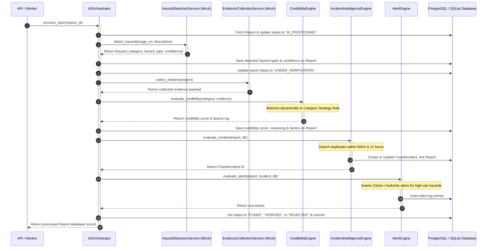

# AI Processing Sequence Diagram

This document details the sequential message-passing architecture of the **OceanWatch AI Processing Pipeline**.

```mermaid
sequenceDiagram
    autonumber
    participant Client as API / Worker
    participant Orchestrator as AIOrchestrator
    participant Detector as HazardDetectionService (Mock)
    participant Collector as EvidenceCollectionService (Mock)
    participant CredEngine as CredibilityEngine
    participant IntelEngine as IncidentIntelligenceEngine
    participant AlertEngine as AlertEngine
    participant DB as PostgreSQL / SQLite Database

    Client->>Orchestrator: process_report(report_id)
    activate Orchestrator
    
    Orchestrator->>DB: Fetch Report & update status to "AI_PROCESSING"
    
    Orchestrator->>Detector: detect_hazard(image_url, description)
    activate Detector
    Detector-->>Orchestrator: Return {hazard_category, hazard_type, confidence}
    deactivate Detector
    Orchestrator->>DB: Save detected hazard types & confidence on Report
    
    Orchestrator->>DB: Update report status to "UNDER_VERIFICATION"
    
    Orchestrator->>Collector: collect_evidence(report)
    activate Collector
    Collector-->>Orchestrator: Return collected evidence payload
    deactivate Collector
    
    Orchestrator->>CredEngine: evaluate_credibility(category, evidence)
    activate CredEngine
    Note over CredEngine: Matches dynamically to Category Strategy Rule
    CredEngine-->>Orchestrator: Return credibility score & factors log
    deactivate CredEngine
    Orchestrator->>DB: Save credibility score, reasoning & factors on Report
    
    Orchestrator->>IntelEngine: evaluate_incident(report, db)
    activate IntelEngine
    Note over IntelEngine: Search duplicates within 500m & 12 hours
    IntelEngine->>DB: Create or Update FusedIncident, link Report
    IntelEngine-->>Orchestrator: Return FusedIncident ID
    deactivate IntelEngine
    
    Orchestrator->>AlertEngine: evaluate_alerts(report, incident, db)
    activate AlertEngine
    Note over AlertEngine: Inserts Citizen / Authority alerts for high-risk hazards
    AlertEngine->>DB: Insert Alert log entries
    AlertEngine-->>Orchestrator: Return successes
    deactivate AlertEngine
    
    Orchestrator->>DB: Set status to "FUSED", "VERIFIED", or "REJECTED" & commit
    Orchestrator-->>Client: Return processed Report database record
    deactivate Orchestrator
```
